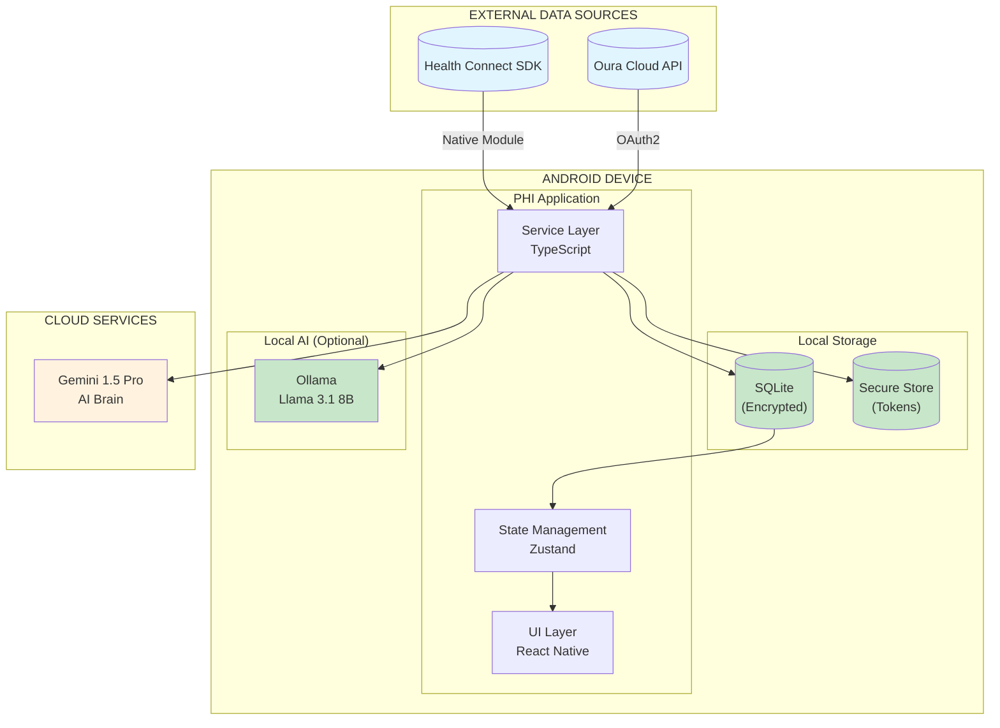
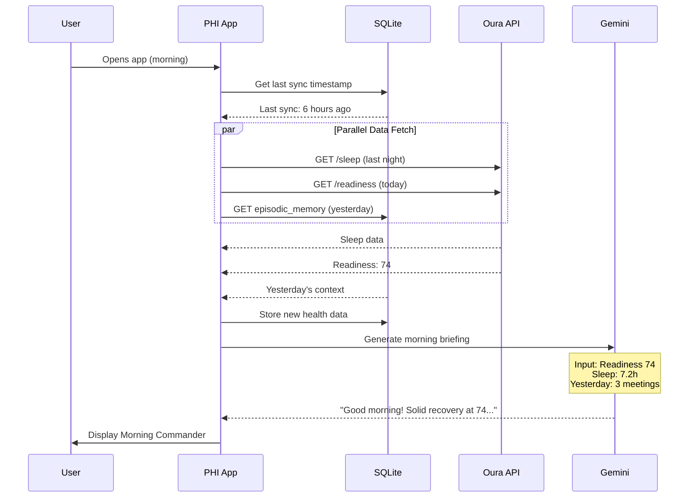
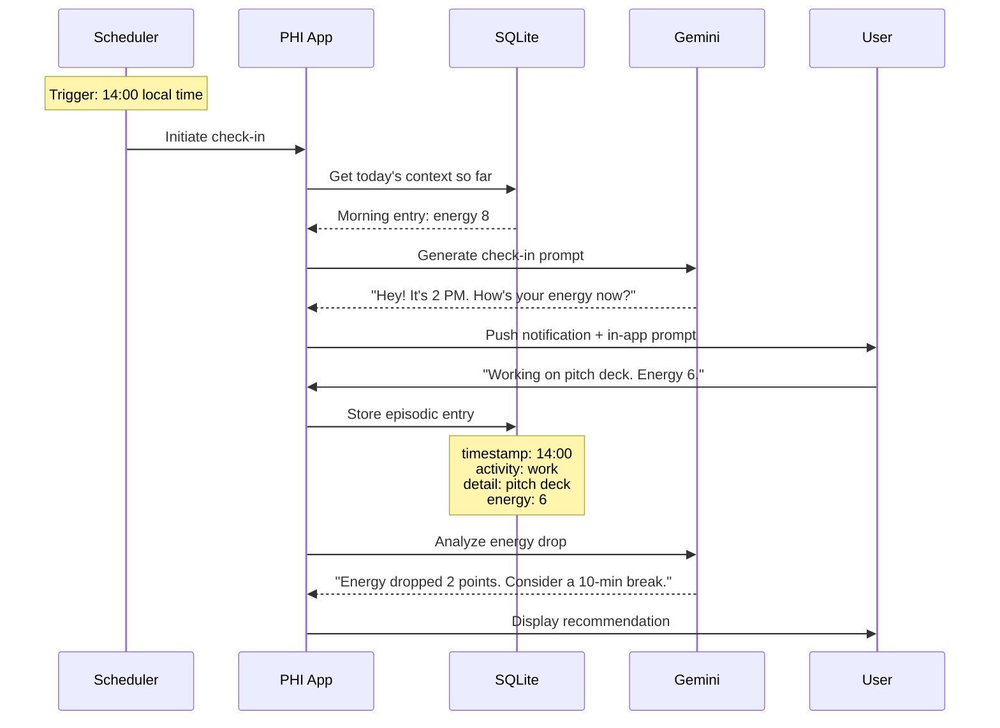
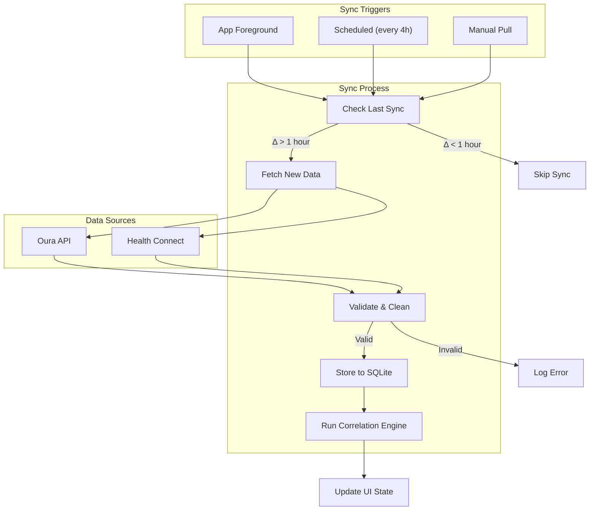
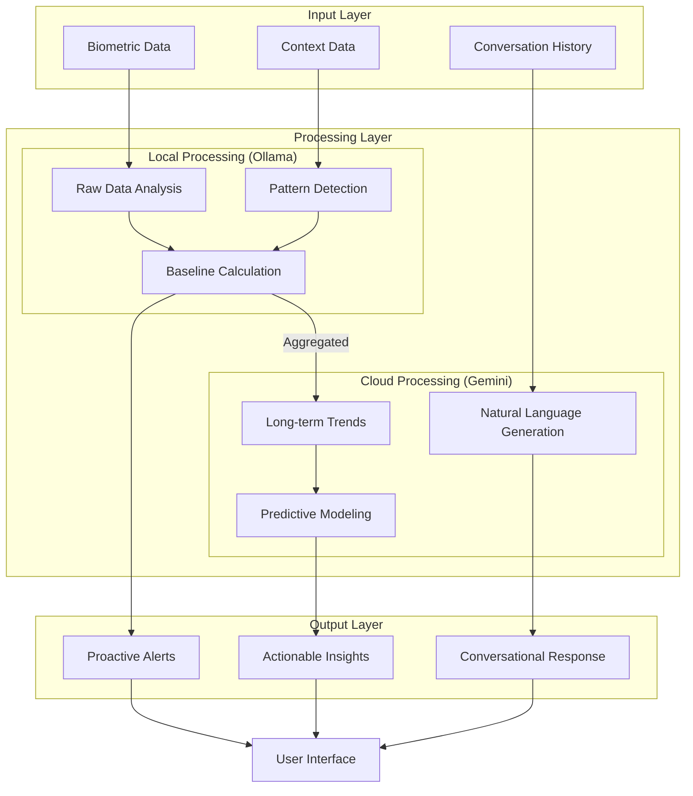
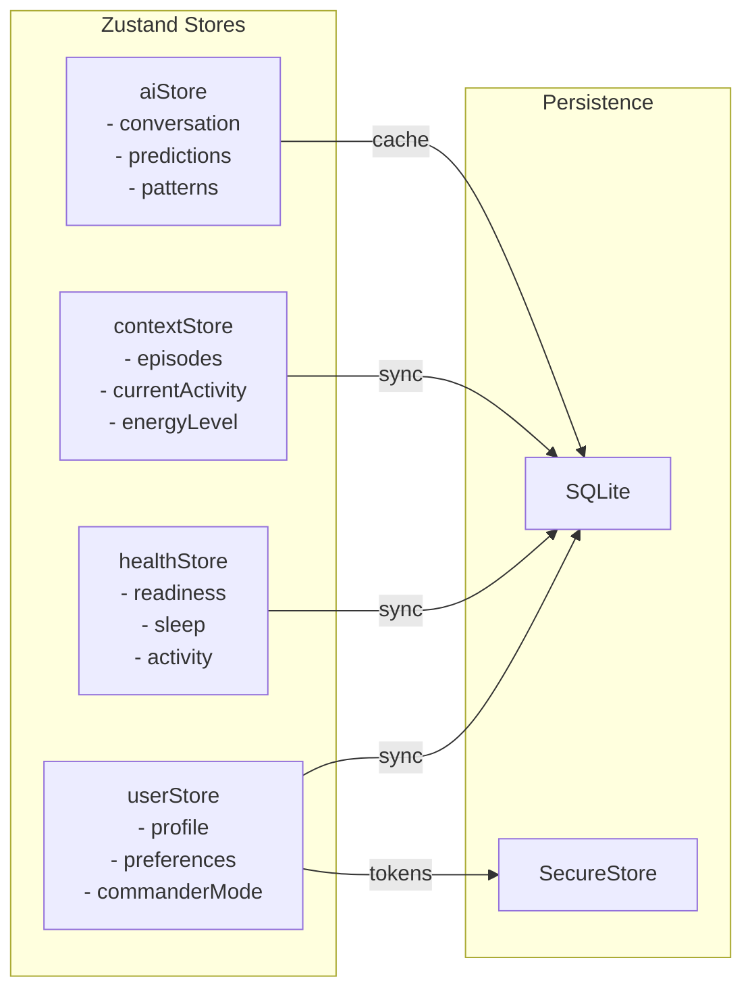
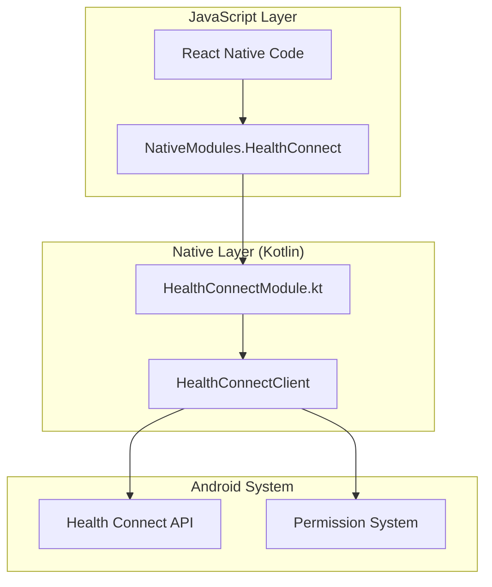
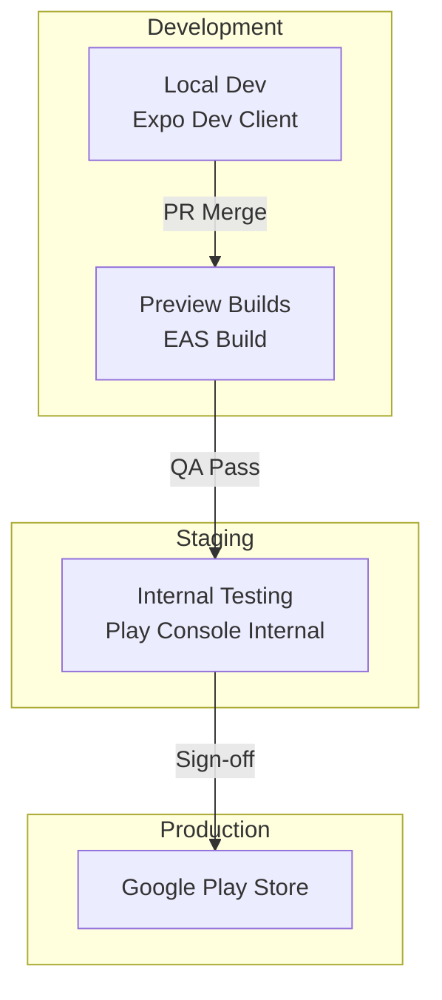

# PHI BLUEPRINT
## System Architecture & Data Flow
**Version:** 1.0.0  
**Classification:** Technical Architecture Document  
**For:** AI Coding Agents (Cursor), Developers  

---

## 1. ARCHITECTURE OVERVIEW

### 1.1 High-Level System Diagram



### 1.2 Technology Stack

| Layer | Technology | Justification |
|-------|------------|---------------|
| **Runtime** | React Native 0.73+ | Cross-platform potential, native module support |
| **Build System** | Expo SDK 50+ (Dev Client) | Fast iteration, EAS Build for native modules |
| **Language** | TypeScript 5.0+ | Type safety, better IDE support |
| **State** | Zustand | Simple, performant, no boilerplate |
| **Storage** | expo-sqlite + SQLCipher | Encrypted local database |
| **Secrets** | expo-secure-store | Keychain/Keystore integration |
| **HTTP** | Axios | Interceptors for auth, retry logic |
| **AI Local** | Ollama (optional) | Privacy-first raw data processing |
| **AI Cloud** | Gemini 1.5 Pro | Long context for trend analysis |

---

## 2. DIRECTORY STRUCTURE

```
phi-app/
├── app/                          # Expo Router screens
│   ├── (tabs)/
│   │   ├── index.tsx            # Morning Commander (Home)
│   │   ├── chat.tsx             # Daily Wingman
│   │   └── insights.tsx         # Trends & Patterns
│   ├── _layout.tsx              # Root layout with navigation
│   └── settings.tsx             # User preferences
│
├── components/
│   ├── commander/
│   │   ├── ReadinessCard.tsx    # Main readiness display
│   │   ├── EnergyForecast.tsx   # Daily energy timeline
│   │   └── ActionItems.tsx      # Today's recommendations
│   ├── chat/
│   │   ├── MessageBubble.tsx    # Chat message component
│   │   ├── QuickResponses.tsx   # Pre-set reply buttons
│   │   └── EnergySlider.tsx     # 1-10 energy input
│   ├── common/
│   │   ├── LoadingState.tsx     # Skeleton loaders
│   │   └── ErrorBoundary.tsx    # Error handling wrapper
│   └── themes/
│       ├── HighEnergy.ts        # Red/Orange theme
│       ├── ZenMaster.ts         # Blue/Teal theme
│       └── Recovery.ts          # Green theme
│
├── services/
│   ├── database/
│   │   ├── index.ts             # DB initialization
│   │   ├── schema.ts            # Table definitions
│   │   ├── migrations.ts        # Version upgrades
│   │   └── queries.ts           # CRUD operations
│   ├── api/
│   │   ├── oura.ts              # Oura API client
│   │   ├── healthConnect.ts     # Health Connect wrapper
│   │   └── gemini.ts            # Gemini API client
│   ├── ai/
│   │   ├── brain.ts             # AI orchestration layer
│   │   ├── prompts.ts           # System prompts
│   │   ├── correlation.ts       # Pattern detection
│   │   └── predictions.ts       # Energy forecasting
│   └── sync/
│       ├── scheduler.ts         # Background sync jobs
│       └── reconciliation.ts    # Data conflict resolution
│
├── hooks/
│   ├── useReadiness.ts          # Readiness data hook
│   ├── useEpisodicMemory.ts     # Context storage hook
│   ├── useAI.ts                 # AI response hook
│   └── useTheme.ts              # Commander mode theming
│
├── stores/
│   ├── userStore.ts             # User preferences
│   ├── healthStore.ts           # Biometric data
│   ├── contextStore.ts          # Episodic memory
│   └── aiStore.ts               # AI state & history
│
├── types/
│   ├── health.ts                # Health data types
│   ├── context.ts               # Episodic memory types
│   ├── ai.ts                    # AI response types
│   └── api.ts                   # API response types
│
├── utils/
│   ├── dateTime.ts              # Date manipulation
│   ├── scoring.ts               # PHI score calculations
│   ├── encryption.ts            # Data encryption helpers
│   └── validation.ts            # Input validation
│
├── constants/
│   ├── config.ts                # App configuration
│   ├── prompts.ts               # AI prompt templates
│   └── thresholds.ts            # Health thresholds
│
├── native/                       # Native modules (Kotlin)
│   └── healthconnect/
│       ├── HealthConnectModule.kt
│       └── HealthConnectPackage.kt
│
├── assets/
│   ├── fonts/
│   └── images/
│
├── app.json                      # Expo configuration
├── tsconfig.json                 # TypeScript config
├── babel.config.js               # Babel config
└── package.json
```

---

## 3. DATA FLOW DIAGRAMS

### 3.1 Morning Boot Sequence



### 3.2 Proactive Check-In Flow



### 3.3 Data Synchronization Flow



---

## 4. AI BRAIN ARCHITECTURE

### 4.1 Hierarchical AI System



### 4.2 AI Decision Matrix

| Scenario | AI System | Rationale |
|----------|-----------|-----------|
| Raw HRV interpretation | Ollama (Local) | Privacy: raw biometrics stay on device |
| Daily summary generation | Gemini (Cloud) | Requires nuanced language |
| 7-day pattern detection | Ollama (Local) | Fast, doesn't need external context |
| 30-day trend analysis | Gemini (Cloud) | Long context window needed |
| Real-time energy prediction | Ollama (Local) | Low latency required |
| Personalized recommendations | Gemini (Cloud) | Complex reasoning needed |
| Emergency fallback | Rule-based | When both AIs unavailable |

### 4.3 Prompt Engineering Structure

```typescript
// services/ai/prompts.ts

export const SYSTEM_PROMPTS = {
  MORNING_COMMANDER: `
You are PHI, a Personal Health Intelligence assistant for a High-Energy executive.

PERSONALITY:
- Direct, no fluff
- Data-driven but warm
- Proactive, not reactive
- Challenge-oriented when user is ready

CURRENT COMMANDER MODE: {{commander_mode}}

MODE BEHAVIORS:
- HIGH_ENERGY: Be direct, challenging. Use action words. "Let's crush it."
- ZEN_MASTER: Be calm, supportive. Use measured language. "Easy does it."
- RECOVERY: Be gentle, protective. Encourage rest. "Your body needs this."

OUTPUT FORMAT:
1. One-sentence status (Good/Moderate/Challenging day ahead)
2. Key metric highlight (most important number)
3. One actionable recommendation
4. One optional insight from patterns

DO NOT:
- Use medical jargon without explanation
- Give vague advice like "take care of yourself"
- Ignore context from previous conversations
- Be preachy or guilt-inducing
`,

  CHECK_IN_PROMPT: `
You are PHI conducting a midday check-in.

CONTEXT:
- Morning readiness: {{readiness}}
- Morning energy reported: {{morning_energy}}
- Current time: {{current_time}}
- Known activities today: {{activities}}

TASK:
Ask ONE specific question about current state.
Options (pick most relevant):
1. Energy level (1-10)
2. Current activity
3. Stress level
4. Hydration/nutrition

Keep it casual, max 2 sentences.
`,

  PATTERN_ANALYSIS: `
You are PHI's analytical engine.

DATA WINDOW: Last {{days}} days
USER PROFILE: High-Energy executive, values directness

ANALYZE:
1. Sleep → Energy correlations
2. Activity → Recovery correlations
3. Context → Biometric correlations

OUTPUT FORMAT:
{
  "patterns": [
    {
      "trigger": "description",
      "effect": "description",
      "confidence": 0.0-1.0,
      "recommendation": "actionable advice"
    }
  ],
  "predictions": [
    {
      "metric": "energy|readiness|sleep_quality",
      "value": number,
      "timeframe": "tomorrow|next_week",
      "confidence": 0.0-1.0
    }
  ]
}
`
};
```

---

## 5. STATE MANAGEMENT

### 5.1 Store Architecture



### 5.2 Store Definitions

```typescript
// stores/healthStore.ts
import { create } from 'zustand';
import { persist, createJSONStorage } from 'zustand/middleware';
import AsyncStorage from '@react-native-async-storage/async-storage';

interface HealthState {
  // Current Day Data
  todayReadiness: number | null;
  todaySleep: SleepData | null;
  todayActivity: ActivityData | null;
  
  // Historical Data (7-day cache)
  readinessHistory: ReadinessEntry[];
  sleepHistory: SleepEntry[];
  
  // Computed
  baselineHRV: number | null;
  baselineReadiness: number | null;
  
  // Actions
  setTodayReadiness: (score: number) => void;
  setTodaySleep: (data: SleepData) => void;
  updateHistory: (type: 'readiness' | 'sleep', entries: any[]) => void;
  calculateBaselines: () => void;
}

export const useHealthStore = create<HealthState>()(
  persist(
    (set, get) => ({
      todayReadiness: null,
      todaySleep: null,
      todayActivity: null,
      readinessHistory: [],
      sleepHistory: [],
      baselineHRV: null,
      baselineReadiness: null,
      
      setTodayReadiness: (score) => set({ todayReadiness: score }),
      
      setTodaySleep: (data) => set({ todaySleep: data }),
      
      updateHistory: (type, entries) => {
        if (type === 'readiness') {
          set({ readinessHistory: entries.slice(-7) });
        } else {
          set({ sleepHistory: entries.slice(-7) });
        }
        get().calculateBaselines();
      },
      
      calculateBaselines: () => {
        const { readinessHistory, sleepHistory } = get();
        
        if (readinessHistory.length >= 7) {
          const avgReadiness = readinessHistory.reduce((a, b) => a + b.score, 0) / readinessHistory.length;
          set({ baselineReadiness: Math.round(avgReadiness) });
        }
        
        if (sleepHistory.length >= 7) {
          const avgHRV = sleepHistory.reduce((a, b) => a + b.averageHRV, 0) / sleepHistory.length;
          set({ baselineHRV: Math.round(avgHRV) });
        }
      },
    }),
    {
      name: 'phi-health-storage',
      storage: createJSONStorage(() => AsyncStorage),
    }
  )
);
```

---

## 6. SECURITY ARCHITECTURE

### 6.1 Data Classification

```
┌─────────────────────────────────────────────────────────────┐
│                 DATA SECURITY TIERS                          │
├─────────────────────────────────────────────────────────────┤
│                                                              │
│  TIER 1: CRITICAL (Encrypted at rest + in transit)          │
│  ├── OAuth tokens (Oura, Health Connect)                    │
│  ├── Raw biometric readings                                 │
│  └── Personal identifiers                                   │
│  Storage: expo-secure-store (Keychain/Keystore)             │
│                                                              │
│  TIER 2: SENSITIVE (Encrypted at rest)                      │
│  ├── Aggregated health scores                               │
│  ├── Episodic memory entries                                │
│  └── AI conversation history                                │
│  Storage: SQLite with SQLCipher                             │
│                                                              │
│  TIER 3: STANDARD (Standard SQLite)                         │
│  ├── App preferences                                        │
│  ├── UI state cache                                         │
│  └── Non-personal configuration                             │
│  Storage: AsyncStorage / SQLite                             │
│                                                              │
└─────────────────────────────────────────────────────────────┘
```

### 6.2 Encryption Implementation

```typescript
// utils/encryption.ts

import * as SecureStore from 'expo-secure-store';
import * as Crypto from 'expo-crypto';

const ENCRYPTION_KEY_ALIAS = 'phi_db_encryption_key';

export async function getOrCreateEncryptionKey(): Promise<string> {
  let key = await SecureStore.getItemAsync(ENCRYPTION_KEY_ALIAS);
  
  if (!key) {
    // Generate 256-bit key
    const randomBytes = await Crypto.getRandomBytesAsync(32);
    key = Buffer.from(randomBytes).toString('hex');
    await SecureStore.setItemAsync(ENCRYPTION_KEY_ALIAS, key, {
      keychainAccessible: SecureStore.WHEN_UNLOCKED_THIS_DEVICE_ONLY,
    });
  }
  
  return key;
}

export async function initEncryptedDatabase(): Promise<SQLiteDatabase> {
  const key = await getOrCreateEncryptionKey();
  
  const db = await SQLite.openDatabaseAsync('phi_data.db', {
    // SQLCipher configuration
    enableChangeListener: true,
  });
  
  // Apply encryption key
  await db.execAsync(`PRAGMA key = '${key}';`);
  await db.execAsync('PRAGMA cipher_compatibility = 4;');
  
  return db;
}
```

---

## 7. NATIVE MODULES (Health Connect)

### 7.1 Module Architecture



### 7.2 Health Connect Module Specification

```kotlin
// native/healthconnect/HealthConnectModule.kt

package com.phi.healthconnect

import android.content.Context
import androidx.health.connect.client.HealthConnectClient
import androidx.health.connect.client.records.*
import androidx.health.connect.client.request.ReadRecordsRequest
import androidx.health.connect.client.time.TimeRangeFilter
import com.facebook.react.bridge.*
import kotlinx.coroutines.*
import java.time.Instant

class HealthConnectModule(reactContext: ReactApplicationContext) : 
    ReactContextBaseJavaModule(reactContext) {
    
    private val scope = CoroutineScope(Dispatchers.IO + SupervisorJob())
    private var healthConnectClient: HealthConnectClient? = null
    
    override fun getName() = "HealthConnect"
    
    @ReactMethod
    fun isAvailable(promise: Promise) {
        val status = HealthConnectClient.getSdkStatus(reactApplicationContext)
        promise.resolve(status == HealthConnectClient.SDK_AVAILABLE)
    }
    
    @ReactMethod
    fun requestPermissions(promise: Promise) {
        // Permission request implementation
        // See API_ENDPOINTS.md for full specification
    }
    
    @ReactMethod
    fun getSteps(startTime: String, endTime: String, promise: Promise) {
        scope.launch {
            try {
                val client = getClient()
                val request = ReadRecordsRequest(
                    recordType = StepsRecord::class,
                    timeRangeFilter = TimeRangeFilter.between(
                        Instant.parse(startTime),
                        Instant.parse(endTime)
                    )
                )
                
                val response = client.readRecords(request)
                val totalSteps = response.records.sumOf { it.count }
                
                withContext(Dispatchers.Main) {
                    promise.resolve(totalSteps.toInt())
                }
            } catch (e: Exception) {
                withContext(Dispatchers.Main) {
                    promise.reject("HEALTH_CONNECT_ERROR", e.message)
                }
            }
        }
    }
    
    @ReactMethod
    fun getHeartRate(startTime: String, endTime: String, promise: Promise) {
        // Implementation for heart rate data
    }
    
    @ReactMethod
    fun getSleep(date: String, promise: Promise) {
        // Implementation for sleep sessions
    }
    
    private fun getClient(): HealthConnectClient {
        return healthConnectClient ?: HealthConnectClient
            .getOrCreate(reactApplicationContext)
            .also { healthConnectClient = it }
    }
}
```

---

## 8. ERROR HANDLING MATRIX

| Error Type | Source | Handling Strategy | User Message |
|------------|--------|-------------------|--------------|
| Network timeout | Oura API | Retry 3x, then use cache | "Using cached data. Will sync when online." |
| Auth expired | OAuth | Silent refresh, if fails → re-auth flow | "Please reconnect your Oura Ring." |
| Health Connect unavailable | Android | Graceful degradation | "Samsung Health not available. Using Oura only." |
| Gemini API error | AI | Fallback to Ollama, then rule-based | "Running in offline mode. Basic insights available." |
| Database corruption | SQLite | Restore from last backup, reinit | "Rebuilding your data. This may take a moment." |
| Encryption key lost | SecureStore | Full data reset required | "Security reset required. Please set up PHI again." |

---

## 9. PERFORMANCE TARGETS

| Metric | Target | Measurement |
|--------|--------|-------------|
| Cold start | < 3 seconds | Time to first meaningful content |
| Warm start | < 1 second | Time from background to interactive |
| API response | < 2 seconds | Oura/Gemini round trip |
| AI generation | < 5 seconds | Time to display AI response |
| Database query | < 100ms | Any single query |
| Memory usage | < 150 MB | Peak memory on device |
| Battery impact | < 5% daily | Background sync included |

---

## 10. DEPLOYMENT ARCHITECTURE



---

**END OF BLUEPRINT**

*This document defines the complete system architecture. All implementation must conform to these specifications. Reference this document when making architectural decisions.*
